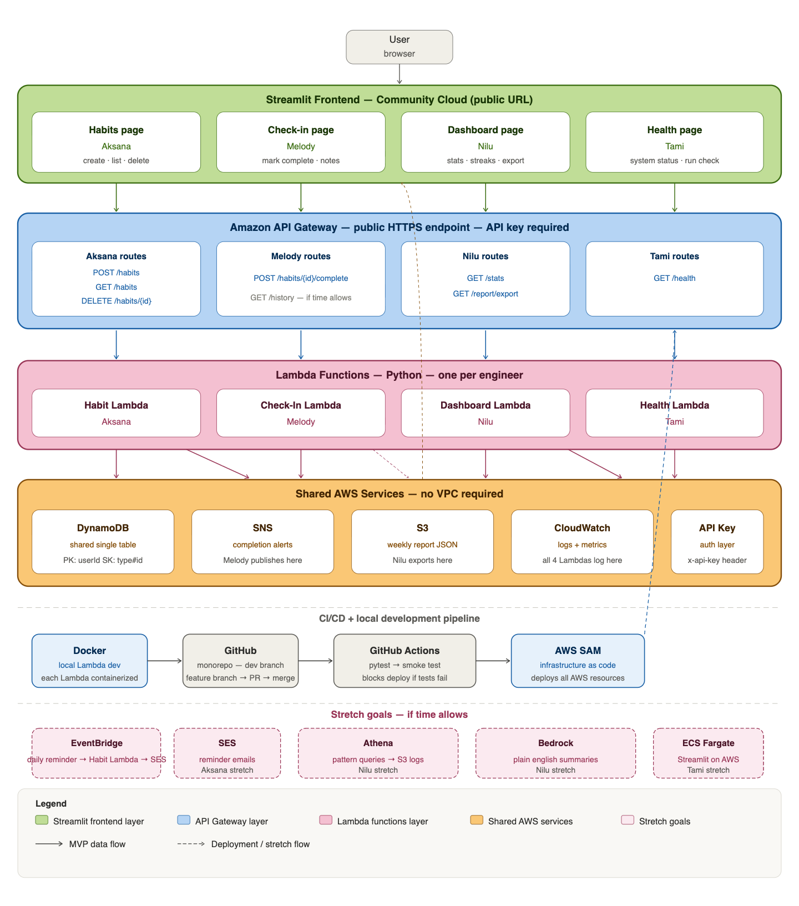

# One More Day — Habit Tracker

A serverless habit tracker built on AWS that helps users build consistent habits by tracking daily progress, maintaining streaks, and generating weekly insights.

Built by a team of four engineers as our Ada Developers Academy capstone, the project was intentionally designed to explore production-style cloud engineering practices including Infrastructure as Code, CI/CD, authentication, observability, automated testing, and event-driven architecture.

**Live Application:** https://one-more-day-kke2zulaouzzarvjyhkrz6.streamlit.app

---

# The Challenge

Many habit trackers record activity but provide little insight into long-term consistency.

Our goal was to build an application that not only records habits, but also helps users understand their progress through streak tracking, weekly summaries, reminders, and analytics.

At the same time, we wanted to design the backend like a real cloud application rather than simply complete a classroom assignment.

---

# Architecture



---

# Engineering Decisions

## Why Serverless?

We chose AWS Lambda because the workload is event-driven and unpredictable. Serverless allowed us to avoid paying for idle infrastructure while still providing automatic scaling.

---

## Why DynamoDB?

A single-table DynamoDB design matched our access patterns while keeping the application simple and highly scalable.

---

## Why Infrastructure as Code?

Instead of manually configuring AWS resources, we defined the entire environment using AWS SAM and CloudFormation.

This allowed the infrastructure to be:

- Version controlled
- Repeatable
- Easier to review
- Easier to troubleshoot
- Deployable with a single command

---

## Why GitHub Actions?

We wanted deployment to be repeatable instead of relying on manual steps.

Our pipeline automatically:

- Runs unit tests
- Runs end-to-end tests
- Blocks deployments when tests fail
- Deploys updated infrastructure using AWS SAM

---

## Why Cognito?

Authentication is handled by Amazon Cognito with JWT tokens so every API endpoint is protected without relying on shared API keys.

---

## Why CloudWatch?

As the project evolved, we realized deployment was only part of operating an application.

CloudWatch gives us visibility into:

- Errors
- Latency
- Throttling
- API failures
- Lambda performance

allowing problems to be identified before users report them.

---

# Key Features

### Habit Management

- Create habits
- Soft delete habits
- Category-based organization
- Current and longest streak tracking

### Daily Check-ins

- One completion per day
- Optional notes
- Automatic streak calculations
- Duplicate prevention using DynamoDB conditional writes

### Analytics

- Weekly completion rate
- Strongest category
- Best day of the week
- Habit performance
- Downloadable reports

### Notifications

- SNS completion notifications
- EventBridge scheduled reminders
- Amazon SES email reminders
- Weekly email summaries

### Observability

- CloudWatch dashboards
- CloudWatch alarms
- Structured logging
- Health monitoring

---

# Technologies

| Category          | Technology                 |
| ----------------- | -------------------------- |
| Language          | Python                     |
| Cloud             | AWS Lambda                 |
| API               | Amazon API Gateway         |
| Database          | Amazon DynamoDB            |
| Authentication    | Amazon Cognito             |
| Infrastructure    | AWS SAM • CloudFormation   |
| Monitoring        | Amazon CloudWatch          |
| Storage           | Amazon S3                  |
| Messaging         | Amazon SNS                 |
| Scheduling        | Amazon EventBridge         |
| Email             | Amazon SES                 |
| CI/CD             | GitHub Actions             |
| Testing           | Pytest • Playwright • Moto |
| Local Development | Docker                     |

---

# Testing Strategy

The project includes multiple layers of testing.

- Unit tests for Lambda functions
- End-to-end tests using Playwright
- Smoke tests after deployment
- GitHub Actions validation before deployment

---

# What We Learned

One of the biggest lessons from this project was that architecture evolves.

As we learned more about cloud engineering, we continually asked ourselves:

> **"If this were a production application, what else would it need?"**

That question drove many of our architectural decisions, including:

- Infrastructure as Code
- Authentication
- Observability
- Deployment automation
- Health monitoring
- End-to-end testing

The result was a project that became much more than a habit tracker—it became an opportunity to learn how modern cloud applications are designed, deployed, monitored, and maintained.

---

# Running the Project

```bash
git clone https://github.com/tagaertner/One-More-Day.git

cd One-More-Day

sam build

sam deploy
```

For local development:

```bash
docker compose up
```

---

# Repository Structure

```
one-more-day/
├── .github/
│   └── workflows/                     # CI/CD testing and deployment workflows
│
├── infrastructure/
│   ├── samconfig.toml                  # AWS SAM deployment configuration
│   └── template.yaml                   # CloudFormation infrastructure definition
│
├── lambdas/
│   ├── analytics/
│   │   ├── Dockerfile
│   │   ├── handler.py
│   │   ├── requirements.txt
│   │   └── tests/
│   ├── checkin/
│   │   ├── Dockerfile
│   │   ├── handler.py
│   │   ├── requirements.txt
│   │   └── tests/
│   └── habits/
│       ├── Dockerfile
│       ├── handler.py
│       ├── requirements.txt
│       └── tests/
│
├── tests/
│   ├── e2e/
│   │   └── test_ui.py                 # Playwright end-to-end tests
│   ├── conftest.py                    # Shared test configuration and fixtures
│   ├── test_analytics_integration.py
│   ├── test_habits_integration.py
│   └── test_checkin_integration.py    # Planned integration coverage
│
├── scripts/
│   ├── create_cognito_users.py
│   ├── get_token.py
│   ├── seed_data.py
│   ├── smoke_test.py
│   └── requirements.txt
│
├── streamlit/
│   ├── analytics_page.py
│   ├── app.py
│   ├── checkin_page.py
│   ├── habits_page.py
│   ├── login_page.py
│   └── requirements.txt
│
├── docs/
│   └── system_design.png
│
├── docker-compose.yml                 # Local containerized development
├── pytest.ini                         # Pytest configuration
└── README.md
```

---

# Future Improvements

- AI-powered habit recommendations using Amazon Bedrock
- Richer behavioral analytics with Amazon Athena
- Expanded dashboard visualizations
- Additional operational metrics
